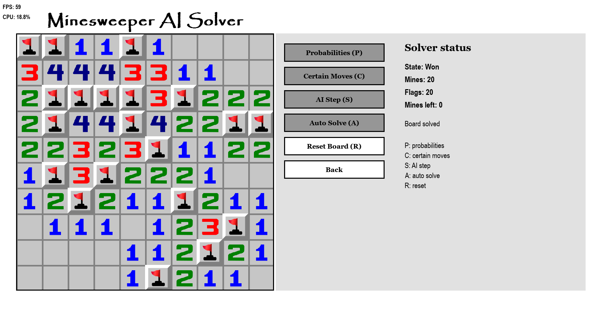
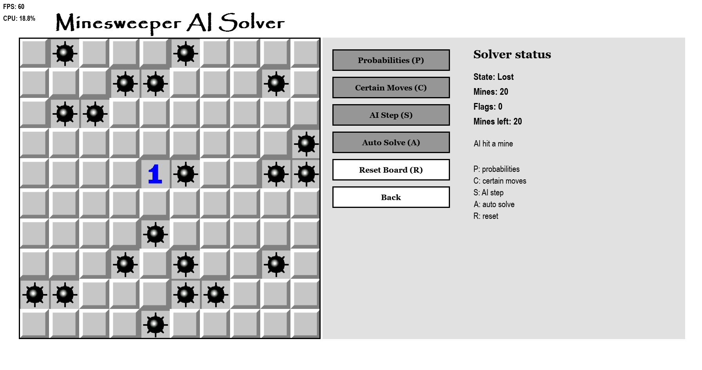

# Minesweeper probability solver

This project is a playable Pygame version of Minesweeper with an assistant that
turns the visible numbered cells into constraints. It can mark certain moves,
show estimated mine probabilities, take one step, or continue automatically
until it wins, loses, or reaches a recognised forced guess.


## The problem

Minesweeper alternates between two very different situations: some moves follow
logically from the revealed numbers, while others can only be ranked by risk. I
wanted the program to expose that distinction instead of presenting every AI move
as if it were certain.

## The approach

Each revealed number becomes a linear constraint over its neighbouring hidden
cells. The solver works in stages:

1. apply the standard all-mines and all-safe local rules;
2. compare overlapping neighbour sets to find additional certain cells;
3. solve the remaining frontier as a SymPy linear system;
4. enumerate valid binary assignments when the frontier is small enough;
5. weight those assignments by the ways remaining mines can be placed away from
   the frontier;
6. choose a certain move, or otherwise the lowest displayed risk.

The game protects the first manual or AI reveal by relocating a mine if necessary.
It also validates flags against visible numbers before asking the solver to use
them as constraints.

## What I found

Local rules solve many positions, but overlapping constraints are what make the
assistant noticeably more capable than a neighbour-by-neighbour heuristic. Exact
probabilities are practical only while the number of free frontier parameters is
small: this implementation caps exact enumeration at 18 parameters. Beyond that,
it preserves any constant safe/mine deductions and assigns unresolved cells a
coarser global remaining-mine rate.

That distinction matters. A displayed percentage is exact only when enumeration
completed; on a complex board it can be an estimate. The auto-solver pauses when
an exact frontier exposes a best risk of 50% rather than silently pretending one
of the two cells is preferable.

No benchmark campaign is committed, so this repository does not claim a solver
win rate. The screenshots show individual game states, not statistical evidence.

## Example outcomes

| Solved board | Lost after a risky reveal |
| --- | --- |
|  |  |

## Run the game

Create an environment and install the three runtime packages:

```powershell
python -m venv .venv
.\.venv\Scripts\Activate.ps1
python -m pip install pygame-ce psutil sympy
python minesweeper/start.py
```

The repository also contains a prebuilt `game.exe`, but the source command is the
clearest way to inspect or change the solver.

## Controls

| Input | Action |
| --- | --- |
| Left click | Reveal a tile. |
| Right click | Add or remove a flag. |
| `P` / `L` | Show or hide probabilities. |
| `C` | Apply all currently certain moves. |
| `S` | Run one solver step. |
| `A` | Start or pause automatic solving. |
| `R` | Reset the board. |
| `Escape` | Return from the game or options screen. |

The options screen changes music volume and selects a square board from `6x6` to
`16x16`. Mine count stays close to 20% of the board area.

## Repository guide

| Path | Purpose |
| --- | --- |
| `minesweeper/start.py` | Pygame window, menus, game session, and solver controls. |
| `minesweeper/functions.py` | Board operations, constraint solving, and probability calculation. |
| `minesweeper/visual.py` | Loads and draws the tile artwork. |
| `minesweeper/images/` | Tile and icon assets. |
| `image.png`, `wincondition.png`, `AIlosingcondition.png` | README screenshots. |

## Current status and limitations

The game and solver are implemented, but there is no automated test suite,
benchmark harness, pinned dependency file, or project licence. Exact enumeration
still grows exponentially, and the large-frontier fallback is a coarse estimate
that does not preserve every local correlation. Those are the main boundaries to
address before comparing the algorithm rigorously with other Minesweeper solvers.
